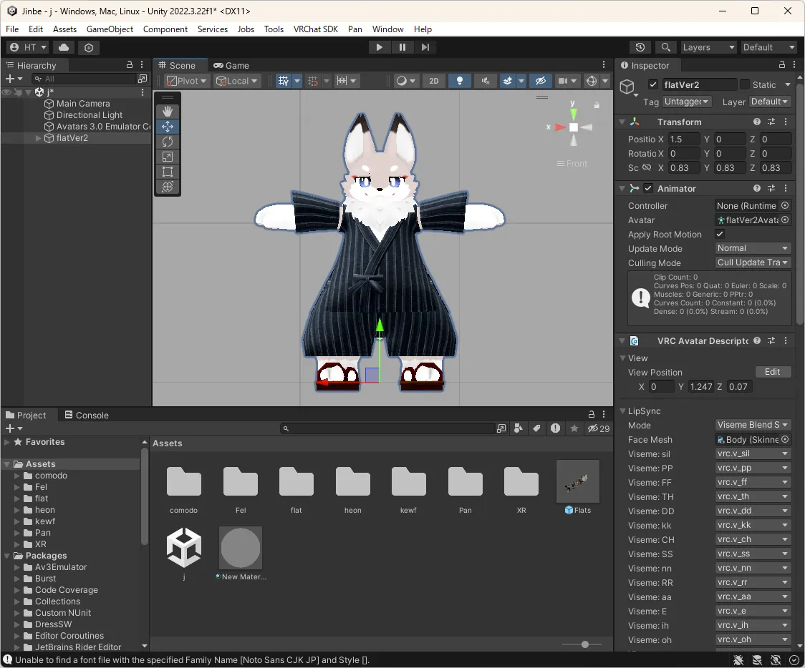
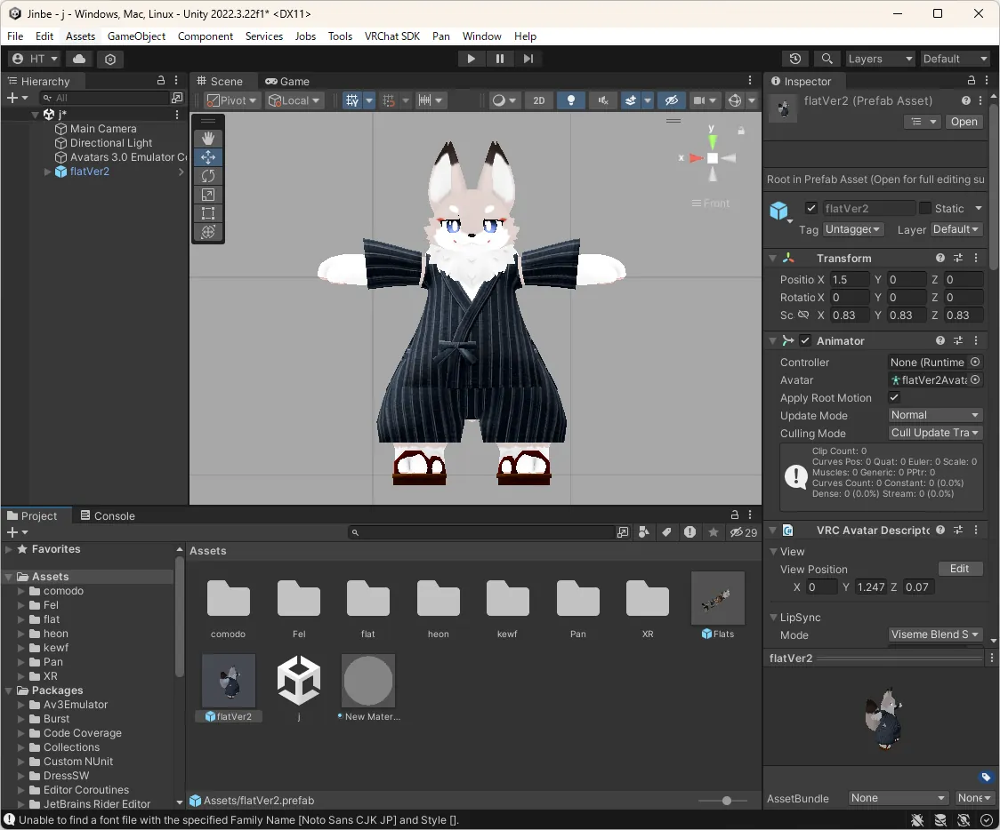
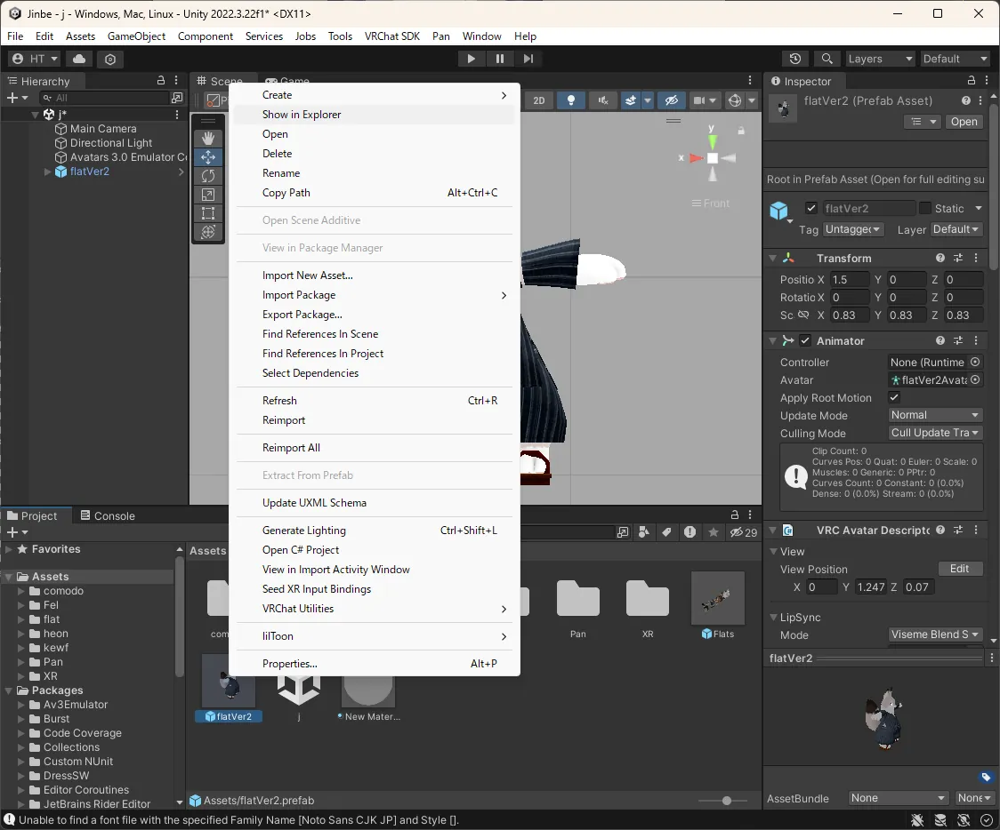
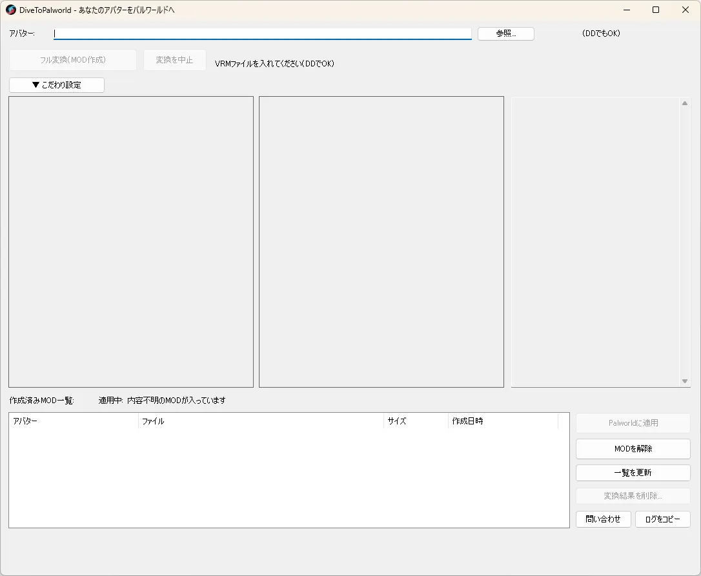
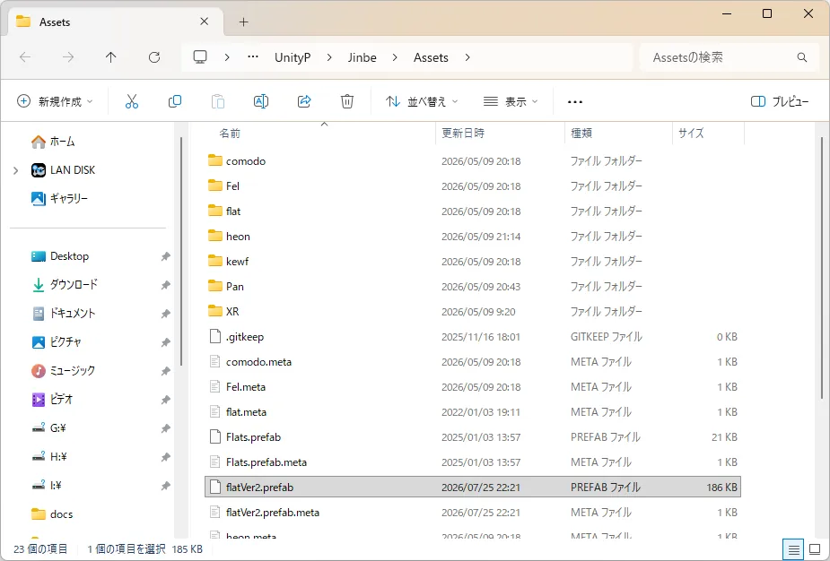
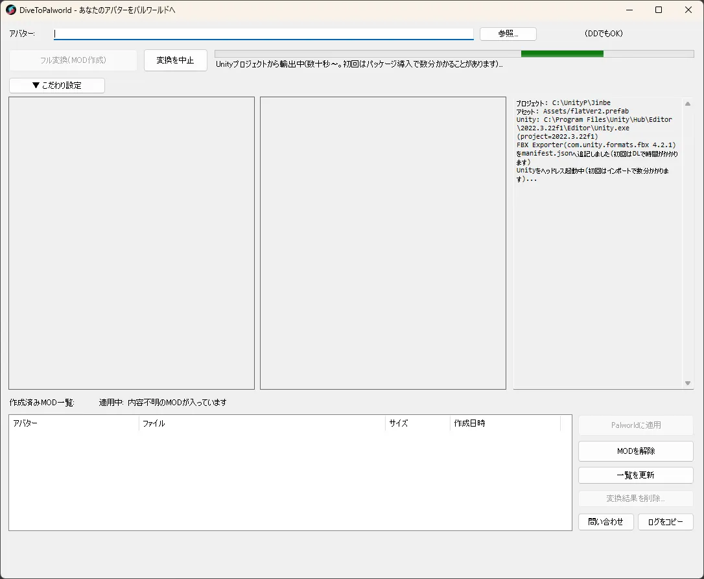
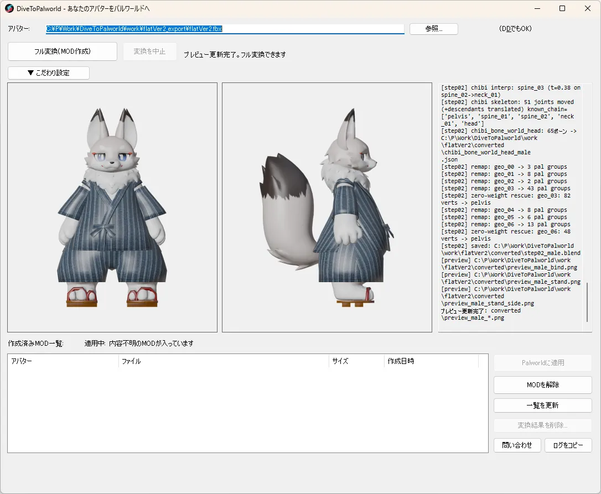
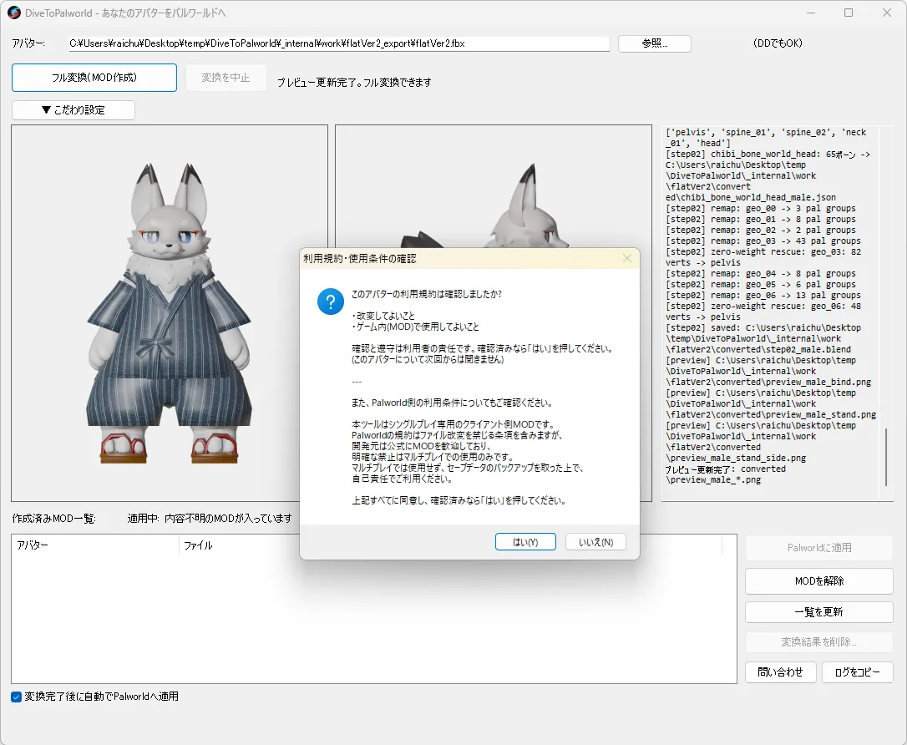
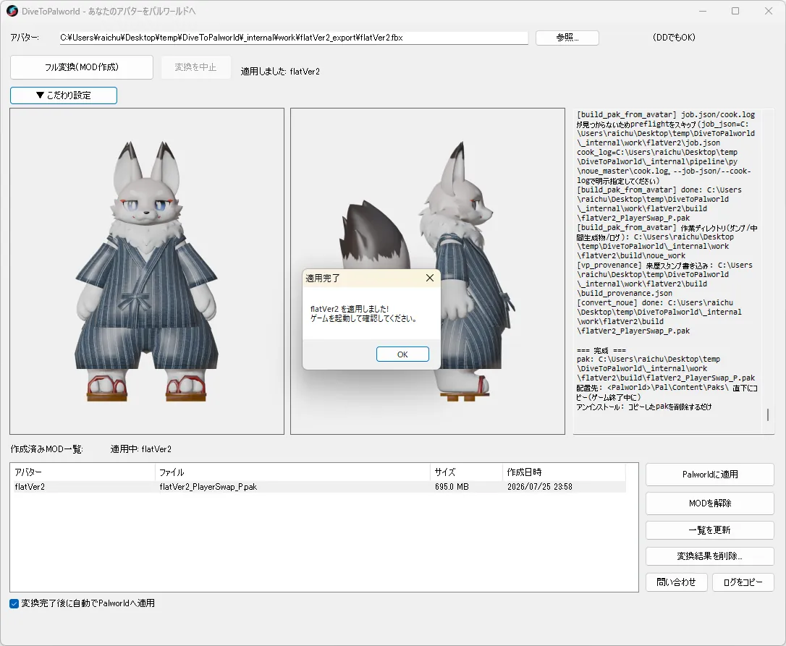

# Uchinoko for Palworld 使用方法 — VRChat 模型篇

*[日本語](manual.md) | [English](manual.en.md) | [한국어](manual.ko.md) | [繁體中文](manual.zh-TW.md)*

## 角色模型的使用方法
打开自己角色模型的 Unity 项目(可在 Unity 2022.3.22f1 上运行)。

将 Hierarchy 中自己的角色模型拖曳并放到 Assets 下方(这样会将其转为 prefab)。

在刚生成的图标上单击右键,选择「Show in Explorer」。
**退出 Unity**。

打开 Uchinoko for Palworld(Uchinoko.exe)。

**仅首次启动时**,会显示「首次设置」对话框,自动下载转换所需的 Blender(约 350MB)。根据网络环境不同可能需要几分钟,请**耐心等待**。若在此处取消,之后的转换将全部失败。若进行不顺利,请参考下方的「遇到问题时」。

从资源管理器将自己角色模型的 prefab 文件拖放到 Uchinoko for Palworld 上。

请稍候片刻。

缩略图显示后,「完整转换(创建 MOD)」按钮即可点击,请点击它。

会显示使用条款,请确认内容后同意。

稍候片刻后即完成应用(请先关闭幻兽帕鲁)。

## 遇到问题时: 首次设置(下载 Blender)失败

由于网络连接问题等原因,首次启动时的 Blender 自动下载有时会失败。若拖放后加载一直无法完成,或因错误而停止,请先怀疑这个原因。

1. 请先确认网络连接,然后重新启动 Uchinoko for Palworld,或点击画面右下角的「重新获取 Blender」按钮。
2. 若仍然失败,可以手动准备。
   1. 从 https://www.blender.org/download/ 下载 Blender 4.3.2 的 Windows x64 版(Portable/zip)。
   2. 解压下载的 zip,将内含 `blender.exe` 的文件夹内容,直接复制到与 Uchinoko for Palworld 同一位置的 `assets\tools\blender-4.3.2-windows-x64\` 文件夹中(**根据版本不同,该文件夹可能位于 `_internal\assets\tools\blender-4.3.2-windows-x64\`**。可通过 Uchinoko for Palworld 同一位置是否存在 `_internal` 文件夹来判断)。

## Tips

- 本转换工具是供个人使用自己的角色模型游玩的工具。不支持多人游玩等用途。
- 不支持与其他 pak MOD 并用。检测到其他 pak MOD 时会显示警告。
- 右下角的菜单可以执行多种操作。
  - 应用到幻兽帕鲁…当您转换了多个角色并想切换,或转换完成时幻兽帕鲁正在运行而未能顺利应用时使用
  - 解除 MOD…想要解除时使用
  - 刷新列表…刷新 MOD 列表
  - 删除转换结果…想删除不再需要的角色时使用
  - 问题反馈…遇到困难时使用
  - 手动复制日志…附加于问题反馈中,能帮助我们更快排解问题
